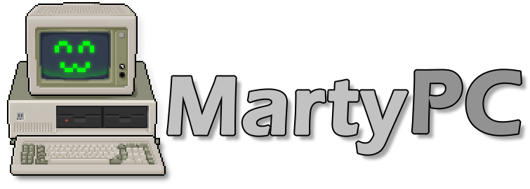
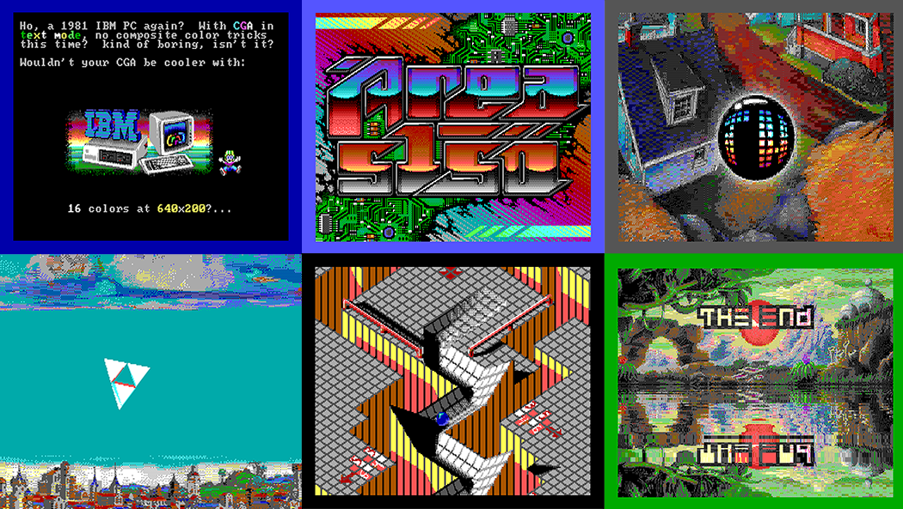
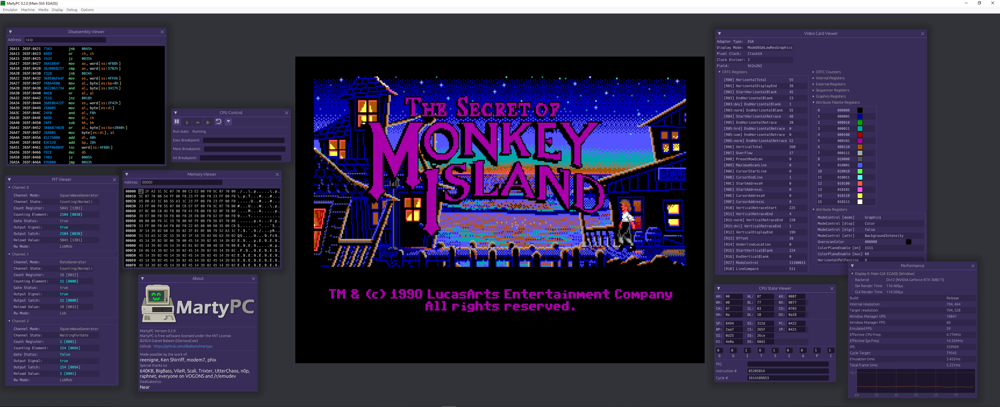
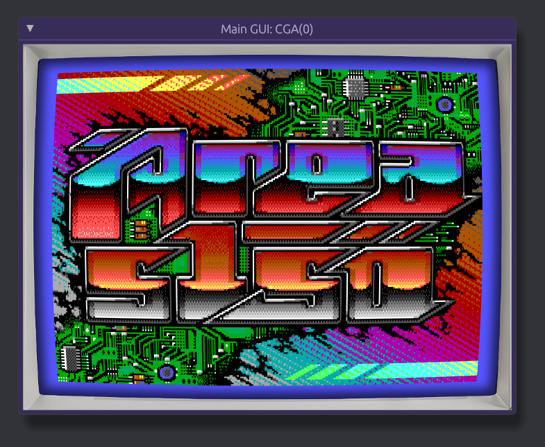

MartyPC is a cross-platform emulator of early PCs written in Rust. It supports Windows, Linux and macOS.
MartyPC emulates several 8088-based systems including the IBM PC, XT, PCJr, and Tandy 1000.

# >>> NEW: Try the [web version](https://martypc.net) of MartyPC! <<<

## User Guide

[Click here to access the MartyPC User Guide](https://github.com/dbalsom/martypc/wiki/MartyPC-User-Guide)

## Downloading MartyPC

Builds are available through periodic [releases](https://github.com/dbalsom/martypc/releases). Newer, automatic builds are available via the [Actions tab](https://github.com/dbalsom/martypc/actions/) under the Artifacts for each workflow run. (You will need to be logged in to GitHub to download Artifacts).

## Why another PC emulator?

MartyPC began as a hobby project to see if I could write an emulator from scratch while learning the Rust programming language. My original goals for MartyPC were modest, but it has reached a level of functionality that I could have never imagined.

MartyPC's intended niche in the emulation world is an aide for retro PC development. It is packed with debugging tools and logging facilities, with many more planned. It may not be as user-friendly to set up as other emulators, but if you are familiar with edting configuration files you shouldn't have any major problems. Programmers writing software for the Intel 8088 can see and measure the exact cycle-by-cycle execution of their code.

## Accuracy

Development of MartyPC started in April 2022. I began work on making MartyPC's 8088 CPU emulation cycle-accurate in 
November 2022. To do so, I validated the operation of the CPU against a real 8088 CPU connected to an Arduino MEGA 
microcontroller. See my [Arduino8088 project](https://github.com/dbalsom/arduino_8088) for more details. This allows an instruction to be simultaneously executed on the emulator and a real CPU and the execution results compared, cycle-by-cycle. More info on this process is described [on my blog](https://martypc.blogspot.com/2023/06/hardware-validating-emulator.html).

In June 2024 I updated the 8088 test suite once again to support exercising of the 8088's prefetch queue. Many more cycle inaccuracies were found and corrected. MartyPC passes the [8088 V2 Test Suite](https://github.com/SingleStepTests/8088) with 99.9997% cycle-accuracy.

Extensive hardware research has been performed to improve MartyPC's peripheral emulation as well, including
investigating the 8253 timer chip with an Arduino, investigating [DMA timings with an oscilloscope](https://martypc.blogspot.com/2023/05/exploring-dma-on-ibm-pc.html), and ultimately, [building a bus sniffer](https://martypc.blogspot.com/2023/10/bus-sniffing-ibm-5150.html) using a logic analyzer.

In April 2023, MartyPC became accurate enough to run the infamous PC demo, [8088 MPH](https://www.pouet.net/prod.php?which=65371).

In May 2023, MartyPC became the first PC emulator capable of emulating every effect in the PC demo [Area 5150](https://www.pouet.net/prod.php?which=91938). (See video here: https://www.youtube.com/watch?v=zADeLm9g0Zg)

## Online Demos

The WebAssembly build of MartyPC can run both [8088MPH](https://dbalsom.github.io/martypc/web/player.html?title=8088mph) and [Area 5150](https://dbalsom.github.io/martypc/web/player.html?title=area5150) in your web browser!

***Note:*** The above links are very outdated - try the [new online version of MartyPC](https://martypc.net), with includes ready-made diskettes
with both demos.

## Features

Currently, MartyPC can emulate an original IBM 5150 PC, 5160 XT, or a generic XT clone machine.

Preliminary support for the IBM PCjr and Tandy 1000 is present as of 0.2.1. These machines may be buggy and unstable.

### Device Support
MartyPC emulates the following devices:

* ### CPUs:
    * **Intel 8088** - A cycle-accurate implementation of the Intel 8088 including the asynchronous BIU, processor instruction queue and prefetch logic. Tested for correctness and cycle-accuracy against hardware.
    * **NEC V20** - A preliminary implementation of the NEC V20 CPU. Cycle-based, but not fully cycle-accurate or as performant as the real thing, as timings have not been adjusted from the 8088 that was used as a base. All native-mode V20 instructions are implemented and tested for correctness against hardware.

* ### System Hardware:
  * **8255 PPI** - Low level keyboard emulation is supported via the PPI and keyboard shift register. Supports the 'turbo bit' found in TurboXT clones.
  * **8259 PIC** - Mostly complete, but still missing advanced features such as priority rotation and nested modes.
  * **8253 PIT** - Highly accurate, supporting PCM audio.
  * **8237 DMAC** - Mostly implemented, but DMA transfers are currently "faked". DRAM refresh DMA is simulated using a scheduling system.
  * **8250 UART** - Supports serial passthrough or mouse emulation.
  * **Game Port** - Supports two analog joysticks with two buttons each.
  * **Parallel Port** - Enough of a basic parallel port is emulated to be detected, but is not really functional for any purpose yet.

* ### Video Devices:
    * **CGA** - A dynamic, cycle-or-character clocked implementation of the IBM CGA including the Motorola MC6845 CRTC controller allows MartyPC to run demanding PC demos like 8088MPH and Area5150. MartyPC takes a unique approach to PC video card emulation by simulating the entire display field - including overscan. Composite output and monitor simulation is supported, via reenigne's excellent composite conversion code (also used by DOSBox and 86Box) 
    * **TGA** - A character-clocked implementation of the PCJr and Tandy Graphics Video Gate Array. Work in progress.
    * **MDA** - A character-clocked implementation of the IBM MDA card built on the Motorola MC6845 CRTC controller. An MDA adapter can be installed alongside a CGA or EGA card for multi-monitor operation.
    * **Hercules** - The MDA device optionally supports emulation of the Hercules Graphics Adapter.
    * **EGA** - A character-clocked implementation of the IBM EGA builds on the techniques used developing the CGA. It is structured to replicate the logical functions of each of the LSI chips on the original hardware. It supports redefinable fonts, vsync interrupts and per-scanline pel-panning for smooth scrolling.  
    * **VGA** - IBM VGA card emulation is in development, but graphics modes such as Mode 13h and Mode X are working.

* ### Sound Devices: 
    * **PC Speaker** - Not really its own sound device, the PC speaker is driven by MartyPC's timer chip emulation. It can produce reasonable quality PWM audio in demos such as 8088MPH, Area5150, and Magic Mushroom.
    * **Adlib** - The original Adlib Music Synthesizer is emulated, with OPL2 emulation provided by nuked-opl3, via my [opl3-rs](https://github.com/dbalsom/opl3-rs) bidings. This is a bit CPU heavy, so you'll need a fast computer. 

* ### Storage Devices:
    * **µPD765 FDC** - Currently robust enough to support both DOS and Minix operating systems. MartyPC uses my disk 
                       image library, [fluxfox](https://github.com/dbalsom/fluxfox/), which allows it to support a wide variety of PC disk image formats.
                       MartyPC's FDC emulation is still not as accurate as I'd like it to be, but it can support a number
                       of copy-protected titles, given a disk image of the appropriate format.
    * **IBM/Xebec 20MB HDC** - Emulated with basic VHD support. MartyPC currently supports a single disk geometry of 20MB when using this controller.
    * **XTIDE** - Emulation of an XTIDE Rev 2 board allows MartyPC to support a wide range of hard disk formats. This emulation is still in early stages, and may be a bit rough around the edges. Not all ATA commands are implemented.
    * **PCjr Cartridges** - PCjr cartridge ROMs are supported, in JrRipCart (.JRC) format

* ### Memory Expansion Devices:
    * **LoTech 2MB EMS Card** - 2MB of EMS memory is made available via the [LoTech EMS board](https://www.lo-tech.co.uk/wiki/Lo-tech_2MB_EMS_Board).  

* ### Input Devices:
    * **Keyboard Support** - IBM Model F, Tandy 1000, and PCjr keyboards are emulated.
    * **Serial Mouse** - A standard Microsoft serial mouse can be connected to the COM port of your choice.
    * **Joystick** - Game port joysticks are emulated via configurable keyboard controls.

### Configuration Support

MartyPC supports custom machine configurations via base machine configuration profiles plus optional extensions called
'overlays', analagous to installing extension cards or other upgrades.

### Debugging Support

MartyPC has an extensive debugging GUI with several useful displays including instruction disassembly, CPU state, memory viewer,
and various peripheral states. Code and memory breakpoints are supported. MartyPC also supports instruction and cycle-based logging.

### Shader support

A basic, configurable CRT shader is included with more to come 
([LibraShader](https://github.com/SnowflakePowered/librashader) support is planned)

## Screenshots

For more, check out the [Screenshot Gallery section of the Wiki](https://github.com/dbalsom/martypc/wiki/Screenshot-Gallery)!

## Special Thanks

I have a long list of people to thank (See the About box!) but I would especially like to mention the contributions made by [reenigne](https://www.reenigne.org/blog/). Without his work reverse-engineering the 8088 microcode, this emulator would never have been possible. I would also like to thank Ken Shirriff and [his excellent blog]((https://www.righto.com/), covering much of the silicon logic of the 8086 (and 8088 by extension).
